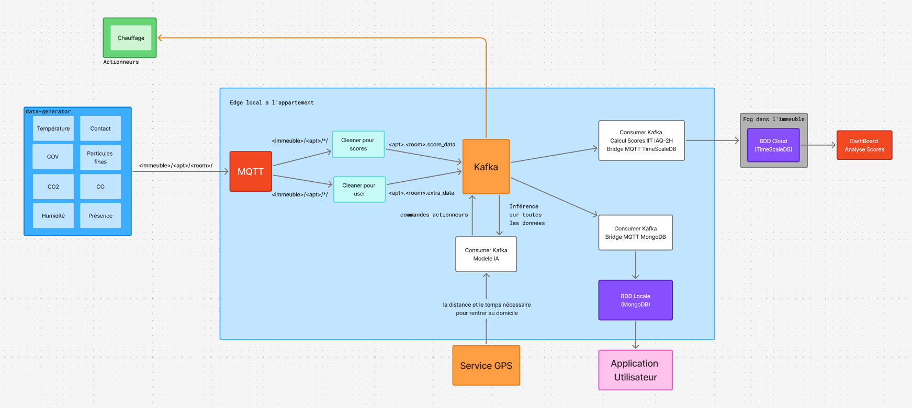

# PROOF OF CONCEPT - PROJET DEV-CPS

AUTHORS : ASSIMPAH Komi Jean Paul - FLANDIN François - MALMASSARY Louis

## 1. Avant-propos

L'objectif de ce POC est de montrer que les pipelines :
- de l'appartement au service utilisateur (modele ia et stockage local) 
- de l'appartement au service client (calcul de scores et monitoring) 

Fonctionnent pour un appartement et pourraient être déployés pour d'autres appartements d'un même immeuble.

Le projet consiste à développer une solution de monitoring à domicile pour réguler le confort de l'**utilisateur** (habitant de l'appartement) à travers différentes métriques _( température, qualité de l'air,... )_ et publier ces données pour que le **client** (gestionnaire d'immeuble) puisse suivre l'état de ses appartements et réaliser des travaux de rénovation.

## Chapitres

1. [Utilisation du POC](#1-comment-utiliser-ce-poc)
2. [Explication de l'architecture](#2-architecture)

## 1. Comment utiliser ce POC

### Prérequis

Assurez-vous d'avoir installé les outils suivants sur votre machine :
- [Docker](https://www.docker.com/get-started/)
- [Docker Compose](https://docs.docker.com/compose/install/)

### Installation

1. Clonez le dépôt Git :
  ```bash
  git clone https://github.com/komi-assimpah/dev-cps.git
  ```

2. Accédez au répertoire du projet :
  ```bash
  cd dev-cps
  ```

### Démarrage

Pour démarrer le système, exécutez la commande suivante :
```bash
docker compose up -d
```

> **Remarque :** Le premier démarrage peut prendre un certain temps, car les images Docker nécessaires seront téléchargées.


### Endpoints

mais fini par exposer plusieurs endpoints, utiles pour comprendre ce qu'il se passe :

[localhost:8081](http://localhost:8081/) - MongoDB
Permet de voir le contenu des collections MongoDB, la collection qui nous interesse ici est : `iot_building/sensor_apt_101`
- il faudra entrer des credentials
  - username : admin
  - password : pass

[localhost:3000](http://localhost:3000/) - Grafana
Permet d'acceder a grafana, le monitoring client, qui permet d'observer l'evolution des scores de qualité de l'air et d'isolation thermique
- pour entrer dans grafana :
  - username : admin
  - password : admin
- pour ajouter la base de donnees `timescaleDB` au dahsboard
  - aller dans `connections > datasources > TimescaleDB`
    - dans `Authentication > password` et entrer `monpassword`
    - cliquer sur Save & test
      - Si le cadre devient vert, tout est bon
      - Sinon recliquer sur Save & test

[localhost:8080](http://localhost:8080/) - KafkaUI
Permet d'accéder aux topics Kafka et leurs contenus
- Cliquer sur le bouton en haut à gauche, puis `Topics > <nom_du_topic> > Messages`

##### Intéragir avec la Base de Données TimescaleDB

Une fois le docker démarré, executer la commande suivante : 

```bash
docker exec -it mon-timescale psql -U monuser -d sensor_scores
```

Quelques commandes pour intéragir avec la table :
```sql
# Afficher les tables
\dt

# Afficher le contenu de la table scores
SELECT * FROM scores;
```

## 2. Architecture



### Les Producers et Consumers

#### Data Generator

Génération réaliste de données capteurs par appartement/pièce (température, humidité, CO₂, PM2.5, CO, TVOC, présence, ouverture fenêtre, conso énergie)

Envoie les données dans deux topics : `building/{apt}/{room}/sensors`

#### Cleaners (pour scores & pour user) - Consumer MQTT / Producer Kafka

Recoivent les donnees du topic `building/{apt}/{room}/sensors`, et nettoient les données avec ce pipeline :
- Nettoyage des valeurs nulles (répète la donnée précédente)
- Vérifie que la donnée est bien comprise dans l'intervale de mesure du capteur (répète la donnée précédente)
- Applique ensuite un filtre médian pour filtrer les outliers

Le consumer pour le score regroupe et traite les donnees utiles pour le consumer kafka de calcul de score, puis les publie sur le topic kafka `<apt>.<room>.score_data`
Le consumer pour le user regroupe et traite les donnees supplementaires inutiles pour le consumer kafka de calcul de score, puis les publie sur le topic kafka `<apt>.<room>.extra_data`

#### Consumer Kafka - Calcul Score - Bridge Kafka / TimescaleDB

S'abonne aux topics `<apt_id>.<room>.score_data`, regroupe les données et calcule les scores:
- IAQ_2h : la qualité de l'air des 2 dernières heures
  - calcule un score sur chaque metrique (co2, co, pm25, cov)
  - realise une moyenne ponderee mettant l'accent sur les hauts scores
  - donne un score entre 0 et 5, 0 étant une qualité de l'air parfaite, et 5 une qualité de l'air excécrable
- IIT : l'indice d'isolation thermique
  - le score n'est pas parfait et aurait besoin d'être paufiné
  - il se calcule ainsi : `conso_moyenne(kwh)/((temp_int-temp_ext)*surface(m2))`

Puis envoie ces scores dans la base de données TimescaleDB pour le monitoring

#### Consumer Kafka - Stockage Client - Bridge Kafka / MongoDB

S'abonne aux topics `<apt_id>.<room>.score_data` ainsi que `<apt_id>.<room>.extra_data`, regroupe les données et les envoie sur MongoDB

#### Consumer Kafka - Modèle IA 

S'abonne aux topics `<apt_id>.<room>.score_data` ainsi que `<apt_id>.<room>.extra_data`, et récupère la position gps de l'utilisateur, il calcule le temps que l'utilisateur devrait mettre pour rentrer et définit une durée de chauffe et une température. Il nécessite encore beaucoup de travail, vous pouvez le tester ainsi : 

1. Créer puis activer un environnement virtuel python
```bash
python -m venv .venv
source .venv/bin/activate
```

2. Installer les packages requis
```bash
pip -r requirements.txt
```

3. Démarrer ensuite la version de démonstration
```bash
python3 heating_service.py
```

### Les brokers

#### MQTT

Sert de passerelle entre les données de l'appartement et les consumer nettoyant les données.

#### Kafka

Sert de passerelle entre MQTT et les différents services essentiels à notre projet, le nombre de topics du broker est 2 fois le nombre de pièces, on limitera donc la partition de chaque topic a 200Mo pour éviter que les queues prennent une taille gigantesque.

### Bases de données & Monitoring

#### TimescaleDB et Grafana

Installée dans le fog de l'immeuble, elle stocke les données du client (scores qualité de l'air, isolation thermique), on utilise une base de données TimescaleDB, on y enregistre deux tables :
- Appartements : qui contient l'identifiant de l'appartement, sa surface et son orientation (Nord, Sud, Est, Ouest)
- Scores : qui contient le timestamp, l'identifiant de l'appartement, le score de qualité de l'air (IAQ), et le score d'isolation thermique

Ces données sont ensuite lues dans grafana pour monitorer la situation des appartements.

#### MongoDB

Unique à chaque utilisateur, elle sert à stocker les données de l'utilisateur, qui seront affichées sur son interface pour que l'utilisateur puisse prendre connaissance de la situation à l'intérieur de son appartement, l'interface utilisateur n'a pas été développée, mais les données sont consultables sur le endpoint MongoDB.
